# Glow Beauty – Online Beauty Store

## Përshkrimi i projektit
Ky projekt është një web aplikacion i thjeshtë për shitjen e produkteve kozmetike, i zhvilluar në PHP.

Projekti demonstron konceptet bazë të PHP si:
- Sessions & Cookies
- GET & POST
- OOP (klasa, trashëgimi)
- Arrays dhe sortime
- RegEx validation
- Role-based access (Admin & User)

---

## Teknologjitë e përdorura
- PHP
- HTML / CSS
- JavaScript
- XAMPP

---

## Si të ekzekutohet

1. Clone repo:

   git clone https://github.com/gentagara6/Online_Beauty_Store.git

2. Vendose në:

   C:\xampp\htdocs\

3. Start Apache (XAMPP)

4. Hap në browser:

   http://localhost/Online_Beauty_Store/pages/index.php

---

## 👤 Login (të dhëna statike)

| Roli  | Email             | Password |
|------|------------------|----------|
| Admin | admin@test.com   | 1234     |
| User  | genta@test.com   | 1234     |
| User  | ernesa@test.com  | 1234     |
| User  | era@test.com     | 1234     |
| User  | enesa@test.com   | 1234     |
| User  | ermira@test.com  | 1234     |

---

## Funksionalitete

- Login / Logout (POST, SESSION, COOKIE)
- Role-based access (Admin / User)
- Produkte dinamike (arrays + OOP)
- Shfaqja e product shades përmes trashëgimisë (MakeupProduct)
- Cart me session & cookie (vizita + last visit)
- Contact form me RegEx validation (server-side)
- Newsletter form me validim të email-it
- Blog me OOP (BlogPost & Repository)
- Visitor counter me file (visits.txt)
- Mesazhe dinamike përmes GET (login, logout, errors)

---

## Struktura e Projektit
```
Online_Beauty_Store/
│
├── assets/
│   ├── css/
│   ├── img/
│   └── js/
│
├── classes/
│   ├── BlogPost.php
│   ├── BlogRepository.php
│   ├── product.php
│   └── makeupproduct.php
│
├── includes/
│   ├── header.php
│   └── footer.php
│
├── pages/
│   ├── index.php
│   ├── shop.php
│   ├── sproduct.php
│   ├── blog.php
│   ├── about.php
│   ├── contact.php
│   ├── cart.php
│   ├── login.php
│   ├── logout.php
│   ├── submit.php
│   └── admin.php
│
├── visits.txt
├── README.md
└── .gitattributes
```
---

## Demonstrimi

## Screenshots

### Home Page
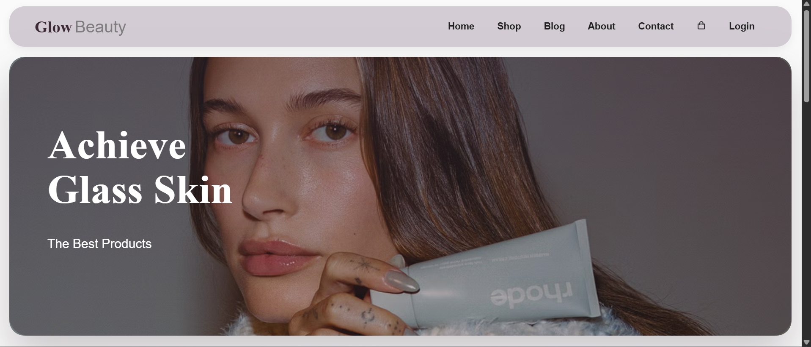

##### Shfaq produktet kryesore. Produktet janë krijuar me OOP (`Product`, `MakeupProduct`), ndërsa te produktet makeup shfaqet edhe `shade`.  
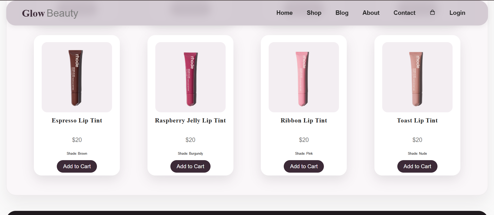

### Login
##### Forma për login me POST, SESSION dhe mesazhe për login të pasaktë, mesazh "Welcome" për login të saktë, dhe mesazh për logout.  
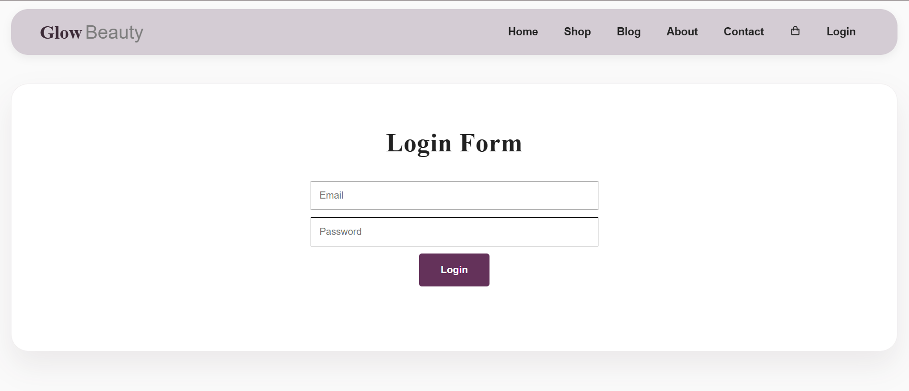
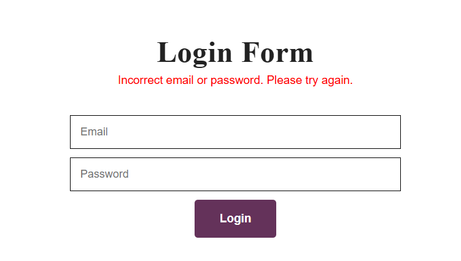
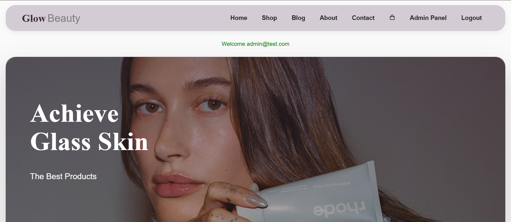
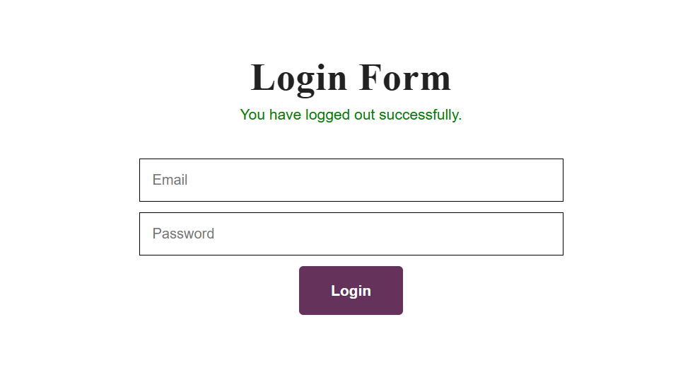
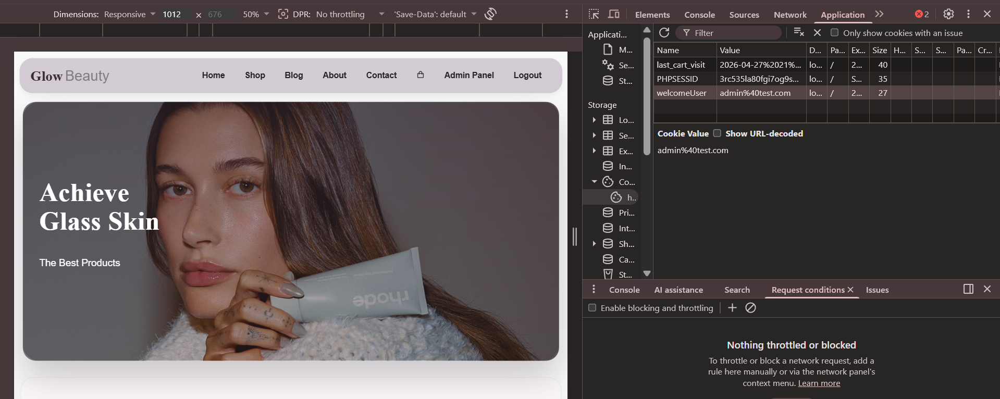

### Admin Panel
##### Faqe vetëm për admin. Shfaq listën e shitjeve përmes arrays dhe llogarit total orders / total sales.  
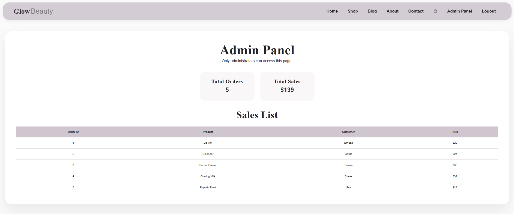

### Shop
##### Shfaq produktet përmes arrays, `foreach`, kushteve dhe sortimit sipas çmimit.  
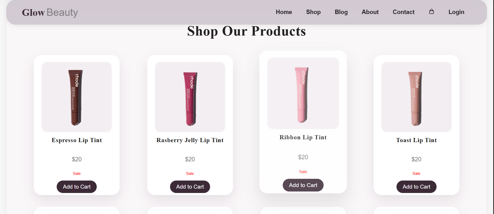

### Blog
##### Postimet shfaqen në mënyrë dinamike përmes klasave `BlogPost` dhe `BlogRepository`.  
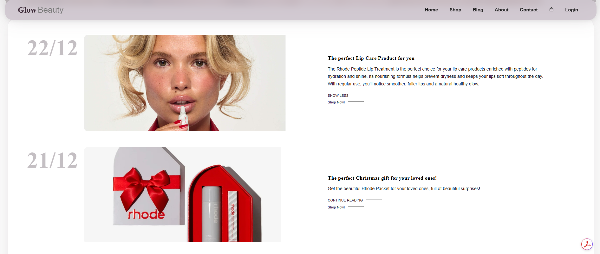

### Contact Form
##### Forma e kontaktit me validim server-side dhe RegEx për emër/email.  
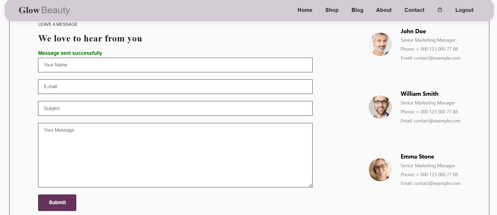
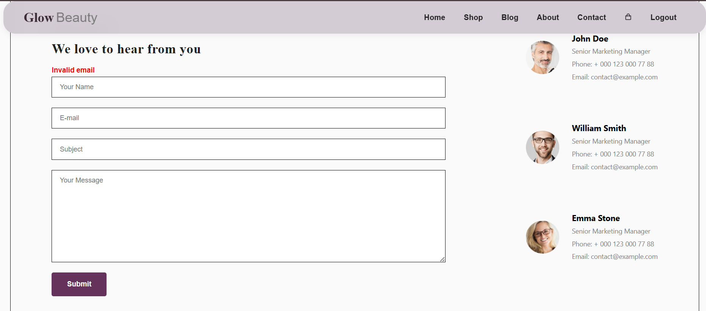

### About Page
##### Faqja About përfshin visitor counter me `visits.txt` dhe newsletter form me validim të email-it.  
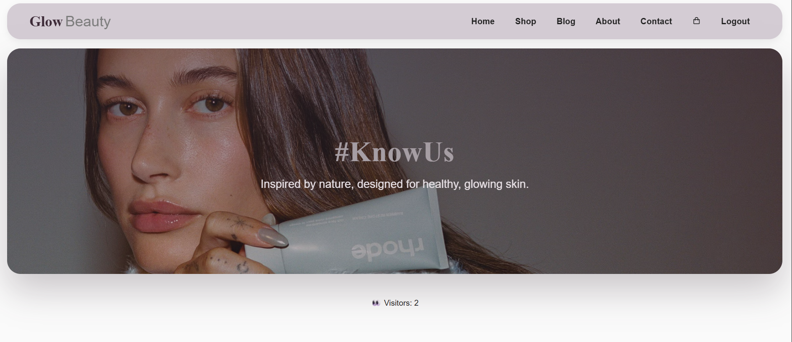
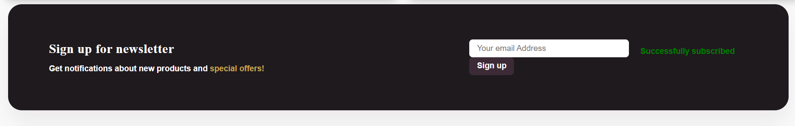
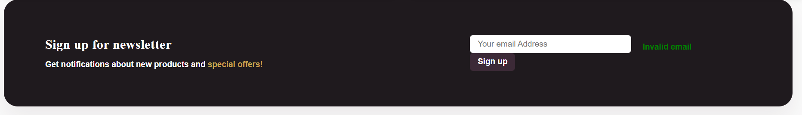

### Cart
##### Shfaq produktet në shportë dhe përdor session/cookies për vizitat në cart.  
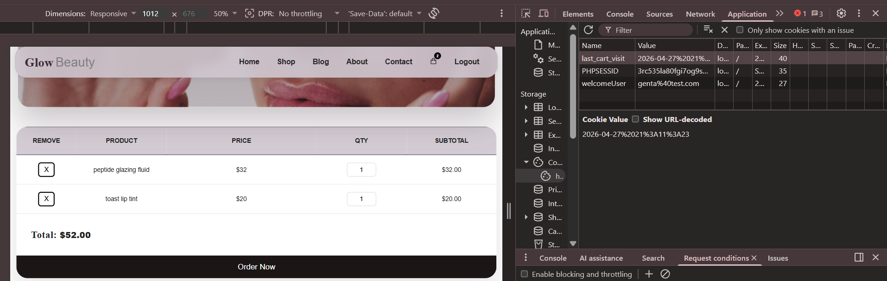

---
